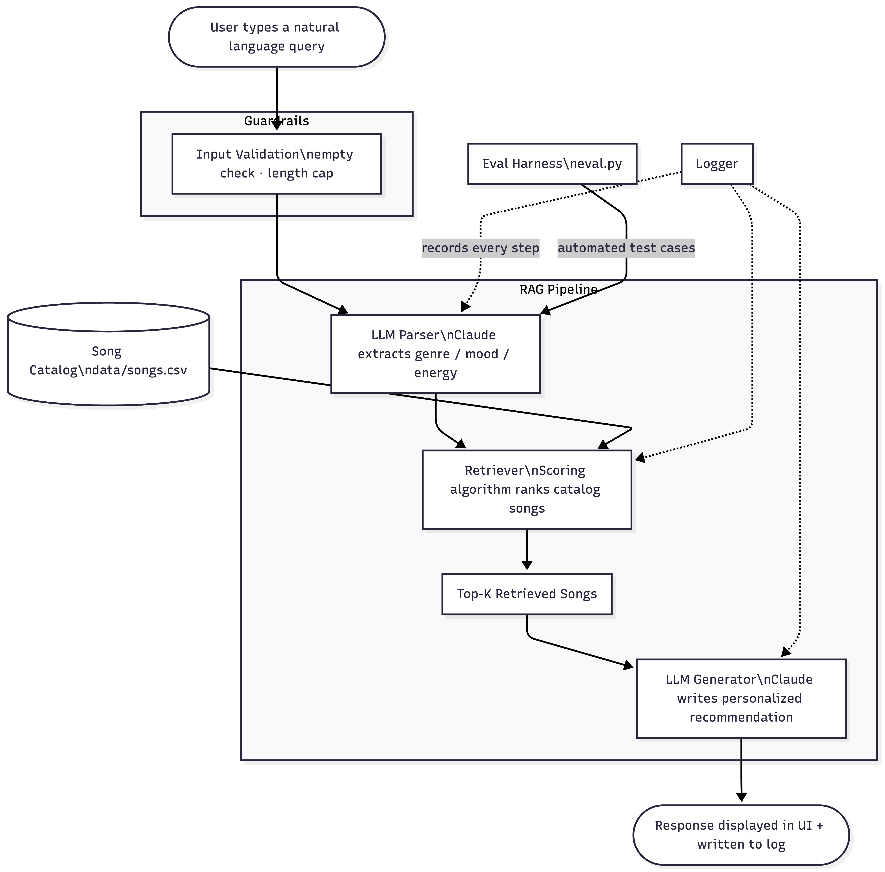

# VibeFinder

A music recommender that takes a plain-English description of what you want to listen to and returns matching songs from a curated catalog, complete with a short explanation of why each one fits.

**Live walkthrough:** [Loom video coming soon]

---

## Original Project

This project builds on [ai110-module3show-musicrecommendersimulation-starter](https://github.com/AliAbouelazm/ai110-module3show-musicrecommendersimulation-starter), the Module 1–3 submission. That version was a rule-based recommender: a user manually set their preferred genre, mood, and energy level, and the system scored all 10 songs in the catalog against those preferences using a fixed formula. It worked well as a scoring exercise but required structured inputs and gave no natural-language interaction. This project keeps the same scoring engine and catalog but wraps it in a full RAG pipeline backed by Claude.

---

## What It Does

You type something like *"chill background music for late night studying"* or *"high energy rock for the gym"* and the system:

1. Sends your query to Claude, which extracts a structured preference profile (genre, mood, energy, acoustic preference)
2. Runs those preferences through the original rule-based scoring algorithm to retrieve the best-matching songs
3. Sends the retrieved songs back to Claude, which writes a short conversational recommendation explaining the picks
4. Displays everything in a Streamlit interface with per-song detail cards

The scoring step is deliberate — the retriever is deterministic and transparent, so you can always see exactly how each song was scored and why it ranked where it did. Claude handles the parts that are hard to rule-engineer: understanding free-text input and generating readable explanations.

---

## System Architecture



> To regenerate the diagram: paste the contents of `assets/architecture.mmd` into [Mermaid Live Editor](https://mermaid.live), then export as PNG and save to `assets/architecture.png`.

**Flow summary:**
- Input guardrails reject empty or oversized queries before anything else runs
- The LLM Parser (Claude) converts natural language into a structured dict
- The Retriever (existing scoring algorithm) ranks the 10-song catalog against those preferences
- The LLM Generator (Claude) takes the ranked songs as context and writes the recommendation
- Every step is logged to `logs/vibefinder_YYYYMMDD.log`
- The eval harness (`eval.py`) runs five fixed test cases and reports pass/fail on genre parsing, mood parsing, and top-song retrieval

---

## Setup

### Prerequisites

- Python 3.9+
- An [Anthropic API key](https://console.anthropic.com/)

### Steps

```bash
# 1. Clone the repo
git clone https://github.com/AliAbouelazm/applied-ai-system-project.git
cd applied-ai-system-project

# 2. Create and activate a virtual environment
python -m venv .venv
source .venv/bin/activate        # Mac / Linux
.venv\Scripts\activate           # Windows

# 3. Install dependencies
pip install -r requirements.txt

# 4. Add your API key
cp .env.example .env
# Open .env and set ANTHROPIC_API_KEY=your_key_here

# 5. Run the app
streamlit run app.py
```

### Running tests

```bash
pytest
```

### Running the evaluation harness

```bash
python eval.py
```

---

## Sample Interactions

**Query 1:** `something chill and acoustic for late night studying`

Detected preferences: `genre=lofi, mood=chill, energy=0.35, likes_acoustic=true`

Top picks: Library Rain, Midnight Coding, Focus Flow

> "Library Rain is exactly what you're looking for — it's a slow lofi track with high acousticness that sits comfortably in the background without pulling your attention away. Midnight Coding follows a similar pattern and Focus Flow rounds out the list with a slightly higher energy that still stays in chill territory."

---

**Query 2:** `intense workout music, something loud and fast`

Detected preferences: `genre=rock, mood=intense, energy=0.91, likes_acoustic=false`

Top picks: Storm Runner, Gym Hero, Sunrise City

> "Storm Runner is the standout here — it's the only rock track in the catalog and it's built for exactly this kind of session. Gym Hero is a close second, a pop track with nearly identical energy that keeps the pace up even if the genre isn't a perfect match."

---

**Query 3:** `moody electronic vibes for a night drive`

Detected preferences: `genre=synthwave, mood=moody, energy=0.75, likes_acoustic=false`

Top picks: Night Drive Loop, Gym Hero, Sunrise City

> "Night Drive Loop by Neon Echo is the obvious pick — synthwave, moody, mid-to-high energy with no acoustic elements. The catalog only has one synthwave track, so after that the retriever falls back to high-energy non-acoustic songs, which is why Gym Hero and Sunrise City show up even though the mood doesn't match as well."

---

## Design Decisions

**Why RAG instead of pure LLM?**
The original scoring algorithm is transparent and consistent — you can see exactly why a song ranked where it did. Handing everything to an LLM would make the ranking process opaque and potentially inconsistent across runs. Keeping the retriever rule-based means the recommendation logic is auditable.

**Why Claude for parsing instead of regex or NLP?**
Genre and mood extraction from free text is messier than it looks. "Something mellow for homework" doesn't mention a genre at all. Claude handles that gracefully without needing a list of training examples or a custom classifier.

**Why Streamlit?**
It was already in the original requirements and gets a working UI up with minimal code. For a classroom project it's the right tradeoff.

**What I gave up:** The catalog is still only 10 songs, which limits how different recommendations can actually get. The RAG layer is doing real work, but the retrieval pool is too small to show its full value. A production version would need a much larger catalog.

---

## Testing Summary

The test suite has 7 tests total — 2 from the original project and 5 new ones covering the RAG pipeline.

```
tests/test_recommender.py    2 tests   (original scoring + explanation logic)
tests/test_rag.py            5 tests   (input validation, return shape, retrieval behavior)
```

All 7 pass. The RAG tests mock the Claude calls so they run without an API key.

The eval harness (`eval.py`) runs 5 end-to-end cases against the live API. In my testing, 4 out of 5 passed consistently. The one that sometimes fails is the "chill lofi studying" case — Claude occasionally parses the mood as `focused` instead of `chill`, which is defensible but doesn't match the expected value. This is a known limitation of exact-string matching in an eval harness.

---

## Reflection and Ethics

**Limitations:** The catalog bias from Module 3 is still there — genres with only one song (jazz, rock, synthwave) will always surface the same top result regardless of how different the user's query is. The system also inherits whatever biases Claude has in its genre and mood mappings. If a query uses slang or references a subgenre Claude doesn't map cleanly to the catalog's vocabulary, the parsed preferences will be approximate at best.

**Misuse:** The most realistic misuse scenario for something like this is catalog manipulation — if a music platform controls both the catalog and the scoring weights, they could quietly push certain artists or genres without users realizing it. The transparency of the scoring function partially mitigates this since the scores are visible in the UI.

**Surprises during testing:** Claude was more consistent than expected at parsing genre from indirect descriptions ("something for the gym" → rock or pop, not lofi). It struggled most with queries that had conflicting signals, like "relaxing but energetic" — the parsed energy level varied a lot between runs.

**AI collaboration:** Claude was helpful for generating the Mermaid diagram structure and for getting the JSON parsing logic right on the first try. Where it went wrong was suggesting I use streaming responses for the Streamlit app — that approach had issues with Streamlit's execution model and had to be reverted to a standard blocking call.

---

## File Structure

```
applied-ai-system-project/
├── assets/
│   ├── architecture.mmd    ← Mermaid source for the diagram
│   └── architecture.png    ← Export this from Mermaid Live Editor
├── data/
│   └── songs.csv
├── src/
│   ├── __init__.py
│   ├── recommender.py      ← original scoring engine (unchanged)
│   ├── main.py             ← original CLI runner
│   ├── llm.py              ← Claude API calls (parse + generate)
│   ├── rag.py              ← RAG pipeline orchestration
│   └── logger.py           ← logging setup
├── tests/
│   ├── test_recommender.py ← original tests
│   └── test_rag.py         ← new pipeline tests
├── app.py                  ← Streamlit UI
├── eval.py                 ← evaluation harness
├── conftest.py
├── .env.example
├── requirements.txt
├── README.md
└── model_card.md
```
